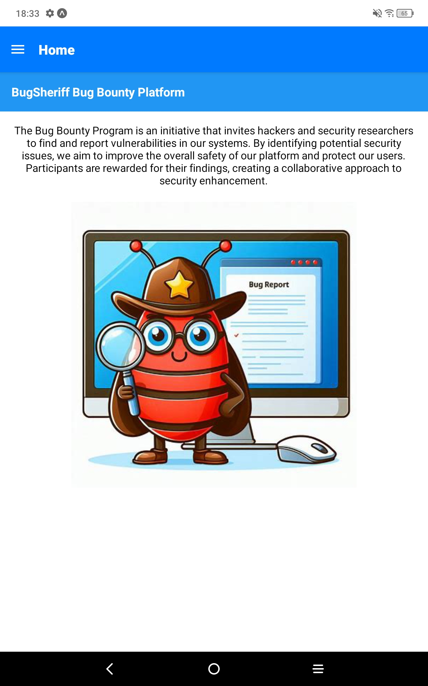

# BugSheriff Bug Bounty Platform

## Project Description
This project is a bug bounty platform where users can report security vulnerabilities and earn rewards. Admin users can manage programs, add new programs, and review user reports.

## Features
- User and admin logins
- Program listing, adding, deleting, and updating
- User report management
- JWT authentication
- Mobile-friendly and user-friendly interface

## Requirements
- Node.js
- Docker
- PostgreSQL
- React Native (with Expo)

## Running the Project

### Run the Docker Backend
1. Navigate to the project directory:
   ```bash
   cd Docker-psql-flask
   ```

2. Run the Docker Compose command: (**If first time, run it TWICE**)
   ```bash
   docker-compose up --build 
   ```

## Database setup

Open another terminal and run the below command:

```bash
docker exec -it postgresql bash
psql -U admin -d bugsheriff
```

### Sample database insert query:
```sql
INSERT INTO programs (name, description, application_start_date, application_end_date, status) VALUES
('Cyber Defenders Bug Hunt',
 'Scope: Web Applications, APIs, and Cloud Infrastructure. Look for Vulnerabilities such as XSS, SQL Injection, and Authentication Bypass. Rewards are Categorized as Low ($50-$150), Medium ($151-$500), and High ($501-$1000).',
 '10-01-2024',
 '12-31-2024',
 'Open'),

('Mobile Security Challenge',
 'Scope: iOS and Android Apps. Test for Insecure Data Storage, Improper Platform Usage, and Security Misconfigurations. Rewards: Low ($100), Medium ($300), High ($700).',
 '09-15-2024',
 '11-15-2024',
 'Closed'),

('E-commerce Bug Smash',
 'Scope: E-commerce Platform Including Checkout Process, User Accounts, and Payment Systems. Prioritize Finding Flaws like CSRF, IDOR, and Logic Flaws. Rewards: Low ($200), Medium ($500), High ($1200).',
 '11-01-2024',
 '01-31-2025',
 'Open'),

('Cloud Fortress PenTest',
 'Scope: AWS, Azure, and Google Cloud Platforms. Focus on Misconfigurations, Privilege Escalations, and Insecure API Gateways. Rewards: Low ($250), Medium ($750), High ($1500).',
 '12-01-2024',
 '02-01-2025',
 'Open'),

('IoT Device Security Crackdown',
 'Scope: Internet of Things (IoT) Devices and Their Companion Applications. Look for Issues like Insecure Firmware Updates, Weak Authentication, and Privacy Vulnerabilities. Rewards: Low ($100), Medium ($400), High ($900).',
 '10-15-2024',
 '12-15-2024',
 'Closed');
```


### Run React Native
1. Ensure you have Expo CLI installed globally:
   ```bash
   npm install -g expo-cli
   ```

2. Navigate to the React Native project directory:
   ```bash
   cd Bugsheriff
   ```

3. Install the dependencies:
   ```bash
   npm install
   ```

4. Start the development server:
   ```bash
   npx expo start
   ```

## Download APK
Install the APK file on your Android device/emulator.

- App is now ready to use!


## Final Notes
- Change the Flask API URL in the React Native project to your Docker container's IP address.

- To stop and remove containers:
   ```bash
   docker-compose down
   ```

- To remove volumes:
   ```bash
   docker volume rm docker-psql-flask_postgres_data

   docker volume rm docker-psql-flask_uploads
   ```

## Home Page


